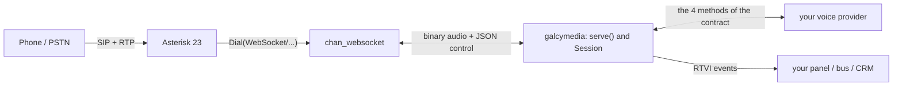
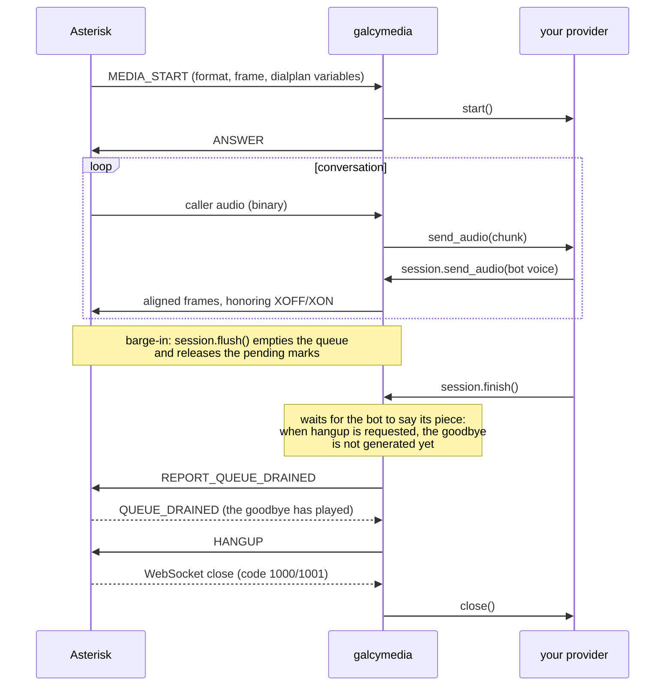

# galcymedia

**Voice agents on Asterisk. Bring your provider, the telephony is already solved.**

[](LICENSE)
[](https://www.python.org/downloads/)
[](https://docs.pipecat.ai/client/rtvi-standard)


Asterisk 23 ships `chan_websocket`, a channel that sends and receives the
audio of a call over a WebSocket: binary frames with the raw samples and
control in JSON, no RTP, no UDP sockets and no NAT between Asterisk and your
program.

On the other side someone has to speak that protocol, honor the flow
control, align the frames and publish what happens. That is galcymedia.



```python
import asyncio
from galcymedia import serve

class MyAgent:
    def __init__(self, session):
        self.session = session

    async def start(self):
        ...                                   # connect to your provider

    async def send_audio(self, chunk):
        await self.session.send_audio(chunk)  # here it echoes back

    async def on_dtmf(self, digit):
        ...

    async def close(self):
        ...

asyncio.run(serve(MyAgent))
```

Four methods. Nothing to inherit from and nowhere to register
(`provider.py`, the `VoiceProvider` `Protocol`).

---

## Seeing it run

This repository is **the library only**. Everything that runs and can be
seen lives in a separate repository:

**<https://github.com/Galcyon-Solutions/galcymedia-examples>**

There you find the Docker stack (Asterisk already compiled, the agent, the
panel and a webphone), the dialplan, the minimal examples (echo,
multi-provider) and the supervision panel. The provider adapters are **not**
there: they live in this library, in `galcymedia.adapters`, and install
through extras.

The library does not drag the demos' dependencies along, and the demos
depend on the published package, not on a relative path.

## Installing it

```bash
pip install galcymedia
```

That installs the core, with `websockets` as the only dependency
(`pyproject.toml`). The adapters live inside the library but **install
separately**, so nobody pays for the one they do not use:

```bash
pip install "galcymedia[pipecat]"     # Pipecat on your Asterisk
pip install "galcymedia[deepgram]"    # Deepgram Voice Agent
```

| Extra | What you get | Where it lives |
|---|---|---|
| `pipecat` | A first-class serializer: your Pipecat pipeline runs on `chan_websocket` | `galcymedia.adapters.pipecat` |
| `deepgram` | Deepgram Voice Agent, native G.711 with nothing converted | `galcymedia.adapters.deepgram` |
| `openai` | OpenAI Realtime | `galcymedia.adapters.openai` |
| `elevenlabs` | ElevenLabs Agents, with the ulaw conversion solved | `galcymedia.adapters.elevenlabs` |

The last three speak the provider's WebSocket directly, so they **bring no
new dependency**: their extra is empty (`pyproject.toml`, `deepgram = []`,
`openai = []`, `elevenlabs = []`) and exists so the name is the same for all
of them.

There is a boundary that decides what breaks when the market moves: the
adapter carries **how the audio and the turn move**, which is telephony and
is maintained here; what the bot **says** and **does** is yours and comes in
through a hook. The dependency runs one way, so `import galcymedia` loads no
provider SDK and a test checks it
(`test_importing_the_package_does_not_import_pipecat`). The why is in
**[docs/decisions.md](docs/decisions.md)**.

You need **Asterisk 23.4.0 or later** with `chan_websocket`:

```
asterisk -rx "core show channeltype WebSocket"
```

If that command does not recognize the channel type, your Asterisk is older
than 23 or was built without the module. The examples repository ships the
installer that builds it, and a Docker image with it already inside.

## The two ports

galcymedia opens up to two ports, always the same ones in the library, in
every example and in the reference dialplan:

| Port | What it is | Who connects | Changed with |
|---|---|---|---|
| **9000** | Media WebSocket (the audio) | Asterisk toward your application, per the `uri` in `websocket_client.conf` | `serve(port=...)` or, in the examples, `MEDIA_PORT` |
| **4573** | FastAGI (the way back to the dialplan), only if you ask for it | Asterisk, per the `AGI(agi://...)` line of the dialplan | `serve(agi_port=...)` or `AGI_PORT` (4573 is Asterisk's standard) |

If you start an agent and no call comes in, the usual suspect is a `uri`
pointing at another port: the WebSocket does not even arrive, so there is no
error to read on this side. The startup line of the log says which port it
listens on and that the `uri` in `websocket_client.conf` has to point there.

**The interface is set separately for each one.** `serve(host=...)` moves
the WebSocket; the FastAGI does NOT follow it, and stays on `127.0.0.1`
unless you pass `serve(agi_host=...)`. It is deliberate: neither protocol
authenticates, and opening the audio to the network is a different decision
from opening the door back into your dialplan. When Asterisk runs somewhere
else, in a container included, both of them need saying.

---

## What it solves

Eight things the channel demands and the library carries. Each one, with
what happens if you skip it and the line of `chan_websocket.c` that proves
it, is in **[docs/protocol.md](docs/protocol.md)**:

- **Flow control**, the `MEDIA_XOFF` at 900 queued frames and the `MEDIA_XON`
  below 800. Keep sending through it and the audio comes out choppy
- **Frame alignment**: the channel drops the tail of any message that does
  not complete a frame, and a voice engine emits free-sized blocks
- **Hanging up without cutting the goodbye**, which is still in the queue
  when you hang up
- **Barge-in**: three queues to flush, and forgetting one leaves the bot
  talking over the person
- **The 128-byte limit** on control messages, dropped with a WARNING in
  Asterisk's log and nothing on the socket
- **Audio that arrives before `MEDIA_START`**, dropped and counted
- **A failure that spreads**: one hung provider does not take the other
  calls with it
- **Data that breaks downstream**: garbage DTMF, bytes in an event, a `NaN`

**That list is the `serve()` path.** Through the Pipecat serializer the
library contributes frame alignment, the codec, the flush of a barge-in and
the hang-up; flow control, the marks and `QUEUE_DRAINED` do NOT travel,
because they are transport mechanics and Pipecat does not model transport.
It is written in the adapter itself, next to the code that decides it. If
you need them, `serve()` is the way in.

## Events: RTVI, not a format of our own

Each call publishes what happens in **[RTVI](https://docs.pipecat.ai/client/rtvi-standard)**,
Pipecat's open standard (protocol 2.1.0). That means any RTVI client already
written understands galcymedia, with no adapters.

```json
{"label":"rtvi-ai","type":"user-transcription","id":"a3f9",
 "data":{"text":"I want to book an appointment","final":true,
         "timestamp":"2026-08-08T18:15:36Z","user_id":"caller"}}
```

The events are emitted by the **core**, not by the provider: each adapter
fills in what its provider knows and stays quiet about the rest. Fourteen
are published, and `describe_events()` lists them with when they go out and
what they carry.

You choose the destination:

```python
def where_they_go(event):
    print(event.to_json())        # or your bus, or your database, or a WebSocket

asyncio.run(serve(MyAgent, emit=where_they_go))
```

## The data that comes in the signaling

Whoever originates the call can put custom headers in the INVITE
(`X-Customer-Id`, `X-Campaign`, whatever you need). The dialplan reads them
and passes them to the channel, and galcymedia hands them to you in the
**first event of the call**, before a single frame plays:

```json
{"label":"rtvi-ai","type":"server-message",
 "data":{"variables":{"CUSTOMER_ID":"A-4471","CAMPAIGN":"collections"}}}
```

With that you query your CRM and paint the record while the phone is still
ringing. The dialplan that produces it, runnable and commented, is in the
examples repository.

---

## The whole channel, not a part of it

`chan_websocket` offers eleven commands and nine events. The library exposes
**all of them**: the ones it needs for its own work and the ones that only
serve you.

| Method | What for |
|---|---|
| `answer()` / `hangup()` | answer and hang up |
| `send_audio()` | send voice, honoring the flow control. Returns `True` if the frame went out and `False` if it was dropped because Asterisk's queue is not emptying |
| `mark()` | wait for a specific point of the audio to play |
| `flush()` | discard what is queued. The barge-in piece |
| `start_buffering()` / `stop_buffering()` | let Asterisk assemble the frames for you, instead of aligning them here |
| `request_status()` | real queue depth, right now |
| `report_when_drained()` | be told when the queue runs empty |
| `pause()` / `continue_media()` | silence without losing what is queued. `pause()` also tells turn-taking: it stops the audio and not the clock, so how much was heard can no longer be measured |
| `set_media_direction()` | listen only, talk only, or both |

And the events **all** reach `on_event`: the session interprets the nine,
and the hook sees them just the same, including those a future Asterisk
release adds. What the channel publishes, you see.

Two details from the channel's source change which method to use, and both
are in **[docs/protocol.md](docs/protocol.md)** with their citations: that
`mark()` travels inside the audio queue and a `flush()` destroys it, while
`report_when_drained()` is a channel flag and survives (which is why
`finish()` uses the second), and that in passthrough mode the channel
rejects 8 of the 11 commands, something it turns on by itself for seven
small-frame codecs.

## Which codec to put on the WebSocket

You pick the codec in the `Dial`, with `c(<codec>)`. The library reads it
from the `MEDIA_START` and adjusts the alignment and the silence byte on its
own; you only decide which one.

**The core does not touch the audio**: it moves opaque bytes between the
channel and the provider. The adapters do convert when their provider
demands it, and there are two concrete cases: ElevenLabs' transcodes alaw to
ulaw and back, because the agent speaks `ulaw_8000`, and Pipecat's decodes
G.711 to PCM and converts the SAMPLE RATE if the pipeline was not built at
the channel's (see decisions.md, "The Pipecat adapter converts the sample
rate and warns"). With the two rates equal not a byte is touched.

Which codec suits depends on one thing: **the codec that rules is your
trunk's, not the WebSocket's.** The audio cannot have more quality than its
weakest link. With that clear, by provider, by origin, and what not to use:

| Your case | Put in the `Dial` | Why | Evidence |
|---|---|---|---|
| Deepgram | `c(ulaw)` or `c(alaw)` | speaks native G.711; any other codec fails at startup with the notice of what to put | `test_the_codec_is_translated_to_the_provider_name`, `test_a_codec_the_provider_does_not_speak_fails_early` |
| OpenAI Realtime | `c(ulaw)` or `c(alaw)` | native `audio/pcmu` and `audio/pcma` | `test_codec_translates_to_provider_type`, `test_a_codec_the_provider_does_not_speak_fails_early` |
| ElevenLabs | `c(ulaw)`; `c(alaw)` works, transcoded by the adapter in both directions | the agent speaks `ulaw_8000` | `test_a_ulaw_channel_does_not_transcode`, `test_an_alaw_channel_transcodes_in_both_directions`, `test_a_non_g711_codec_fails_early`, `test_it_warns_if_the_agent_is_not_in_ulaw` |
| Pipecat, pipeline at 16 kHz | `c(slin16)` | with equal rates not a byte is converted | `test_no_resampling_happens_when_the_rates_match`, `test_it_does_not_warn_when_the_rates_match` |
| Pipecat, pipeline at 8 kHz | `c(ulaw)` or `c(alaw)` | the adapter decodes G.711 to PCM and back; no resampling | `test_the_audio_is_resampled_when_the_rates_differ` (the opposite case), measured: with the pipeline at 16 kHz over an 8 kHz channel, one second of voice plays as two |
| Pipecat, input and output at different rates (TTS at 24 kHz over a pipeline listening at 8) | the same as above | the output converter is picked by the frame's rate and warns once per call | `test_the_output_rate_is_the_frame_rate_not_the_input_rate`, `test_output_at_the_channel_rate_is_not_converted_even_if_the_input_is`; **pending validation on a real call** |
| G.711 trunk (PSTN) | `c(ulaw)` or `c(alaw)` always | the audio is already 8 kHz; `slin16` interpolates band that does not exist and doubles the bytes | `codec_builtin.c` 23.4.1 (`ulaw` and `alaw` at 8000 Hz) |
| `g722` | no | keeps the full API but arrives compressed and no adapter decodes it | protocol.md, "The codecs and passthrough mode" |
| codec2, lpc10, g729, speex, speex16, speex32, opus | no | passthrough: 8 of 11 commands rejected, compressed audio | protocol.md, same section |

**If your trunk comes in with an odd codec, let Asterisk transcode, not your
application.** That is its job, in the signaling: the `c()` of the `Dial`
already asks it to convert the trunk before the audio reaches the WebSocket.
Putting transcoding in an application outside the signaling is exactly what
this design avoids.

**Do not send the channel any of the seven passthrough codecs** (codec2,
lpc10, g729, speex, speex16, speex32, opus). They turn on Asterisk's
*passthrough* mode, which rejects 8 of the 11 commands: **you lose
barge-in, the marks and the clean hangup**, and the audio arrives
compressed, which no adapter decodes. If your trunk uses one of those,
transcode it in Asterisk with the `c()` of the `Dial`. The library warns in
the log when it detects passthrough
(`test_passthrough_warns_instead_of_failing_silently`) instead of starting
silently toward the problem.

## Several providers, and your own

A single process can serve several providers, chosen **per call** from the
dialplan with `Set(_AI_PROVIDER=...)`. The underscore makes the WebSocket
channel inherit the variable, and the library reads it from the
`MEDIA_START`. So one extension routes to Deepgram and another to OpenAI
without restarting anything.

The dispatch is done by a `ProviderRegistry`: you register each provider by
name and it instantiates the one the dialplan asked for.

```python
from galcymedia import ProviderRegistry, serve

registry = ProviderRegistry()
registry.register("echo", Echo)
registry.register("deepgram", DeepgramProvider)
registry.register("my-bot", MyCustomProvider)   # yours, same as the others

asyncio.run(serve(lambda session: registry.create(session.media.provider, session)))
```

A custom provider is exactly the same as one of the bundled ones: a class
with the four methods of the contract. There is nothing special to inherit
from and no interface to implement beyond that. If the dialplan asks for a
name you did not register, `create` raises with the list of the ones that do
exist, instead of failing silently.

## How it is built

```
src/galcymedia/       the package. Knows NO voice provider
├── protocol.py       the 11 commands and 9 events of the channel
├── framing.py        alignment to optimal_frame_size
├── session.py        one call: flow control, marks, close
├── events.py         RTVI events
├── speech.py         SpeechState: the bot's turn-taking, barge-in solved
├── observer.py       ChannelObserver: the channel trace, per call
├── provider.py       the contract: four methods
├── agi.py            FastAGI and AgiRouter: channel access from the process
├── decisions.py      Transfers and CallDecisions: what was decided crosses to the dialplan
├── pcm.py            the bridge to PCM, the alaw/ulaw transcoding and the silence byte
├── server.py         serve() and connect()
└── adapters/         one file per provider, each with its SDK inside
    ├── _shared.py    what the adapters do alike, once
    ├── openai.py     OpenAI Realtime
    ├── deepgram.py   Deepgram Voice Agent
    ├── elevenlabs.py ElevenLabs Agents
    └── pipecat.py    serializer, for a Pipecat pipeline
```

One rule holds it: **the core imports nothing from outside** but
`websockets`. A provider that appears or disappears costs one file, and does
not touch the core. That is why the adapters live in `adapters/`, each
importing its provider's SDK **inside its module**: `pip install galcymedia`
installs only `websockets`, and `import galcymedia` loads nothing
third-party (`test_importing_the_package_does_not_import_pipecat`).

## One call, end to end



On Asterisk's side, the line that starts all of it:

```
 same => n,Dial(WebSocket/voicebot/c(ulaw)f(json),3600,g)
```

`c()` pins the codec, `f(json)` the control format, and the `g` makes the
dialplan continue when the bot hangs up its leg, which is what allows
transferring afterwards. The rest of the dialplan, with the why of every
line and the Asterisk source behind each one, is in
**[docs/architecture.md](docs/architecture.md)**; the full one, with
per-track recording and the outbound queue, in the examples repository.

## Handing the call to a person

The channel cannot transfer or write variables: it is a media channel. So
everyone who wants to escalate to a human trips over the same thing, and the
library brings it solved:

```python
from galcymedia import Transfers, serve

asyncio.run(serve(MyAgent, transfers=Transfers()))
# and when the model asks for it, from the adapter:
#   session.request_escalation("queue", reason="asked for it")
```

`serve()` hands the registry to each session, so the escalation is a single
call: the dialplan seeds `_CALL_ID` before the `Dial` and asks afterwards
over FastAGI, which is the only thing that writes on the channel once the
`Dial` is running. The two routes, the dialplan and the why against
`func_curl`, AMI and ARI are in
**[docs/architecture.md](docs/architecture.md)** and
**[docs/decisions.md](docs/decisions.md)**.

The transfer is the first use: the AGI is **channel access from your
process**. With `AgiRouter` several routes are served (seed CRM data before
the `Dial`, collect results after), and with `CallDecisions` any data
crosses from the WebSocket channel to the dialplan, not only `BOT_ACTION`.
The `galcymedia.pcm` module is the G.711 to linear PCM bridge and back,
without `audioop`, which no longer exists in the standard library; the
Pipecat adapter, ElevenLabs' transcoding and the fill's silence byte use it.

## SpeechState or FrameAligner?

Both align frames; the difference is how much more they do, and the choice
depends on whether your agent can be interrupted:

- **`session.speech` (a `SpeechState`)** for a conversational agent: on top
  of the alignment it brings the whole turn-taking, with barge-in, the
  discard of old audio and the goodbye solved. It is already created in each
  session, derived from the channel's codec; you just use it:
  `await session.speech.play(block)`.
- **`FrameAligner` alone** when there are no turns to interrupt: an echo, a
  recording, an announcement. It is just the alignment, with no states.

An adapter that uses `session.speech` does not touch `FrameAligner`: it
carries it inside. No adapter replaces it today; if you need another, the
assignment `session.speech = SpeechState(session, frame_size, silence_byte)`
is allowed.

## The two connection modes

| Mode | Who connects | When |
|---|---|---|
| **`serve()`** | Asterisk toward your application | **The recommended one.** You open no ports toward Asterisk and it already brings reconnection |
| **`connect()`** | Your application toward Asterisk | When Asterisk cannot reach you, for example behind a NAT. Uses the special `INCOMING` connection |

`serve()` is used in two ways, like `websockets.serve`: `await serve(...)`
runs forever, and `async with serve(...) as server:` embeds it in a larger
application and shuts it down in order on leaving the block.

## The settings are kwargs, with defaults that already work

Every policy of ours (how long to wait for an XON, how much to give the
provider to connect or close, how many caller frames to retain) is a
keyword-only kwarg of `serve()`/`connect()` with a tested default:

```python
serve(MyAgent,
      provider_start_timeout_s=30.0,   # an engine slow to connect
      audio_in_max_frames=100)         # more cushion for an STT with spikes
```

The channel's limits are not exposed, and
**[docs/decisions.md](docs/decisions.md)** explains why.

---

## Status

Version 0.1.0, tested against Asterisk 23.4.1 in two separate exercises.

**Conversation**, on 2026-08-22: real calls with each of the three
providers, with barge-in and escalation to a person. One call at a time.

**Load**, on 2026-08-09: 200 concurrent calls with real RTP in a lab of our
own, 360 frequency-based isolation checks and 0 cross-talk, with **Asterisk**
between 246% and 311% CPU. That figure is the channel's, not this library's:
what it measures is that the audio of 200 calls does not mix. The Python
process serving conversations with real providers at that scale has not been
measured, and when it is, the number will be here.

```bash
pip install -e ".[dev]"
pytest
```

The whole suite runs without Asterisk. Most tests take milliseconds; the
slow ones bring up a real `serve()` and feed it hostile protocol (a provider
that hangs, malformed frames, garbage DTMF) to check that one call's failure
stays contained and the server can always shut down. Those wait on real
timeouts, so the full suite takes about half a minute.

Two tests compare the events against the RTVI specification: they read the
`models.py` of the installed `pipecat-ai` package (extra `pipecat`, protocol
2.1.0) and **skip on their own** if it is missing, which is convenient and
also a trap, because they stop checking without saying so. The Pipecat
serializer tests skip the same way without the extra.

## Going deeper

- **[docs/architecture.md](docs/architecture.md)** is the map of the
  library: which piece does what, where the audio goes, who decides the
  turn-taking and how to read a call's log. You read it before touching the
  code, or when something sounds wrong and you want to know where to look.
- **[docs/protocol.md](docs/protocol.md)** is the technical reference of the
  `chan_websocket` channel: the commands, the events, the limits and the
  protocol gotchas. You consult it when you need the exact fact.
- **[docs/decisions.md](docs/decisions.md)** is the why of the choices you
  could take the other way from your adapter or your dialplan: why FastAGI
  and not ARI, why real-time silence and not a `KeepAlive`, why the server's
  PING. You read it when you want to understand or change a decision.

## License

Apache-2.0. Use it, modify it, sell it. We ask for no credit in your
product; when you redistribute the source, keep the license notice that
section 4 requires.

Made by [Galcyon](https://galcyon.com), Peru.
