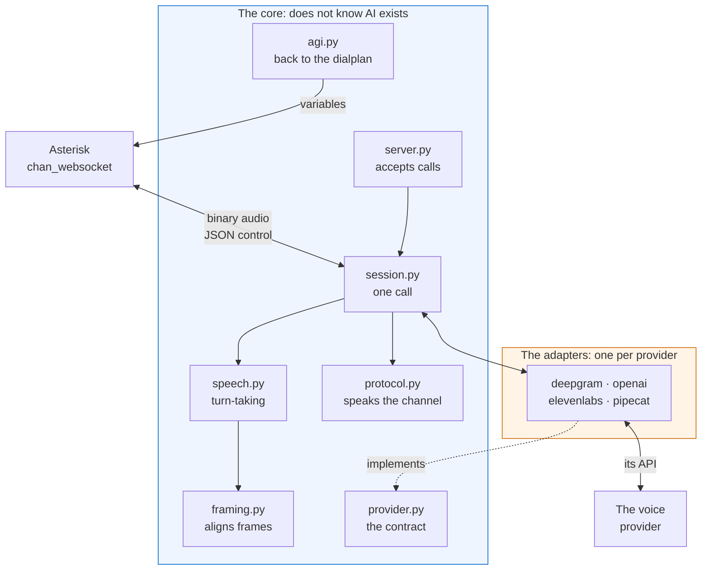
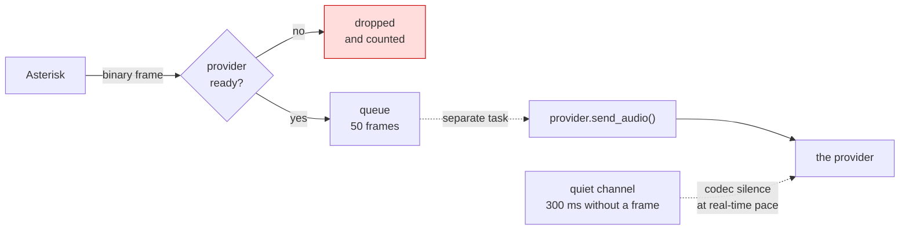
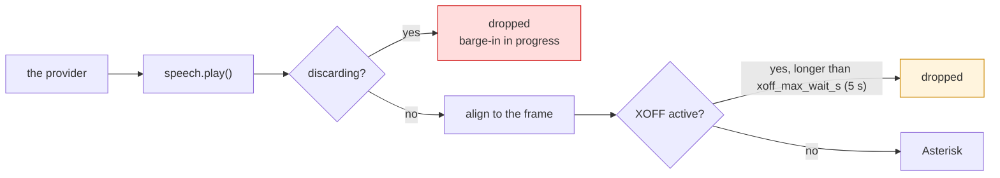
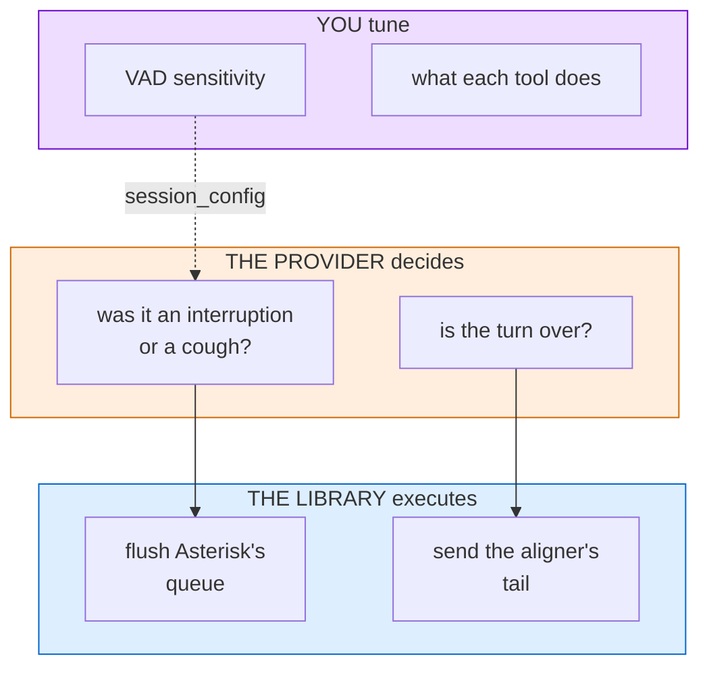
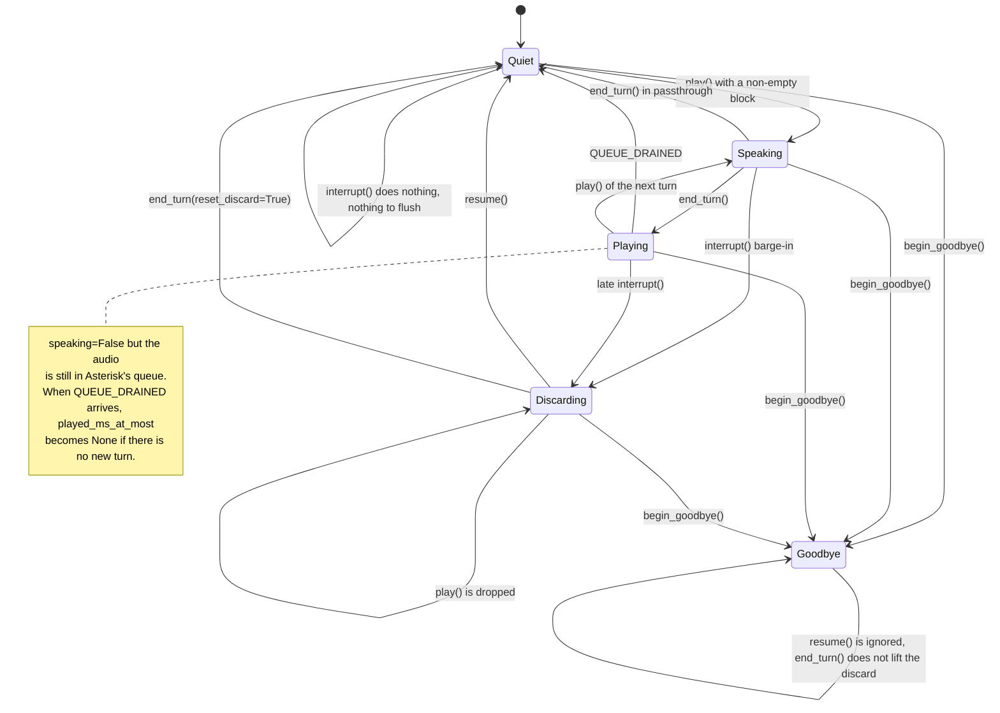
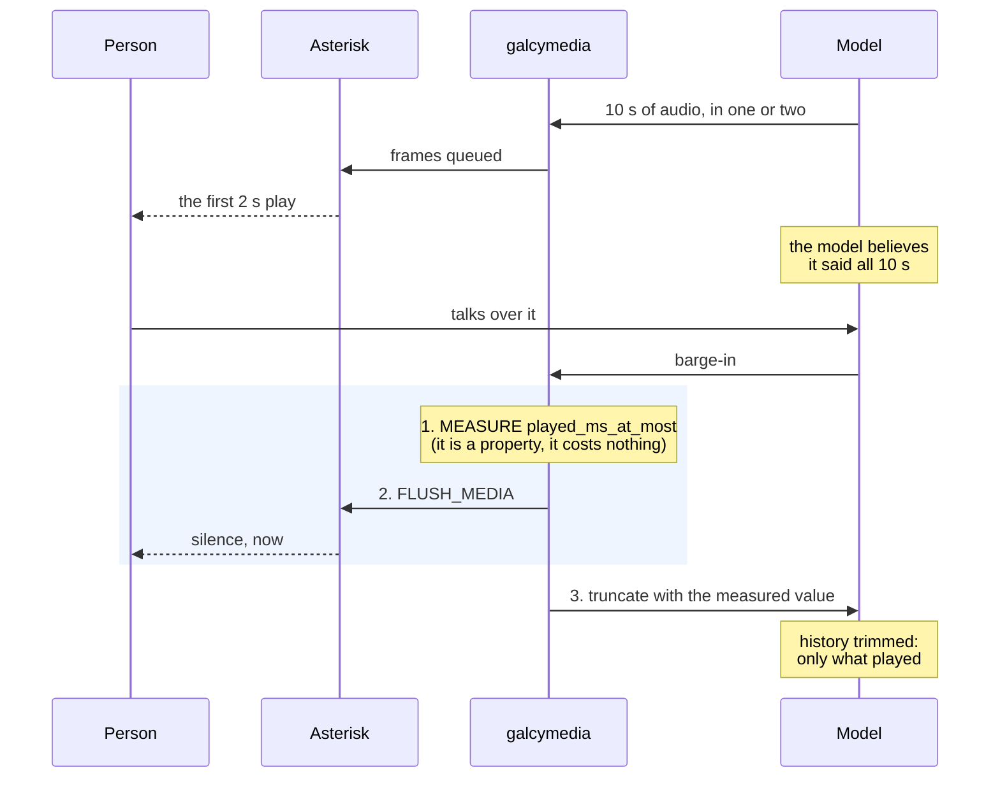
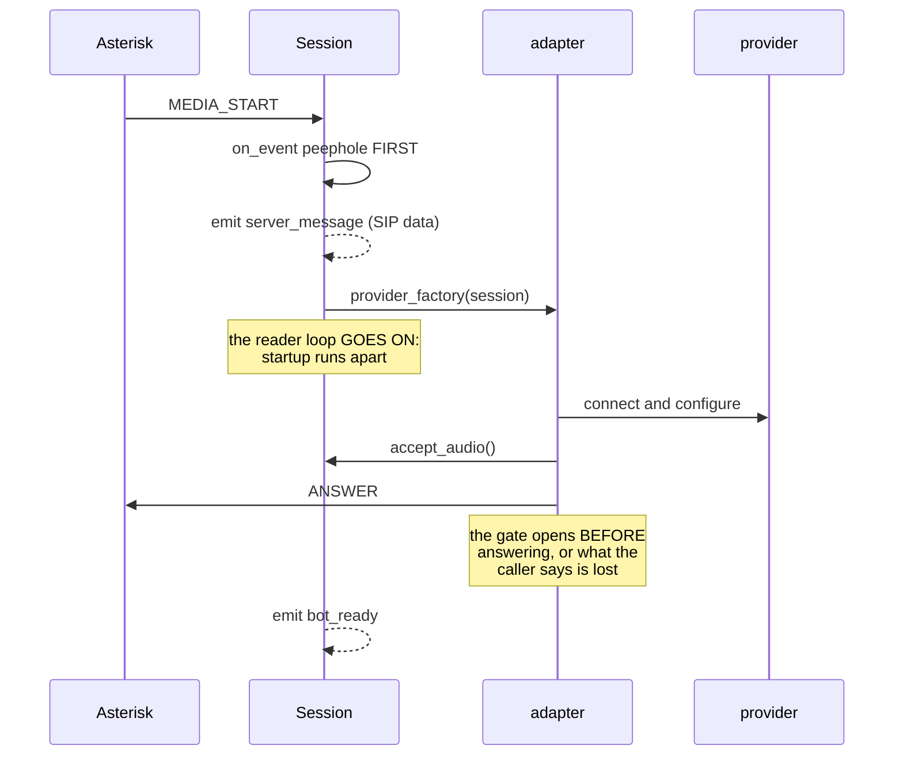
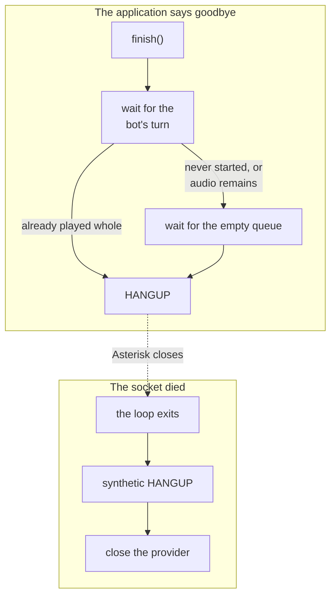

# How it works inside

The map of the library: which piece does what, where the audio goes, and who
decides each thing in a call. It is what you read before touching the code,
once you know how to use it and need to know where what you want to change
lives.

The **why** of each decision is in [decisions.md](decisions.md), and the
exact channel facts in [protocol.md](protocol.md). Here is the shape.

---

## The pieces



**The seam that keeps the project from expiring:** the core imports no
adapter and does not know what a voice provider is. That seam has a file
with its own name, `provider.py`, where the four-method `Protocol` every
adapter fulfills lives. A provider that appears or disappears costs one
file.

| Piece | What it takes care of |
|---|---|
| `server.py` | accepts the calls and opens the FastAGI if asked; with `max_calls` reached it closes the extra connection with 1013 (try again later), and the dialplan continues at the priority after the `Dial` |
| `session.py` | **one call**, from MEDIA_START to hangup. The big class |
| `speech.py` | the bot's turn-taking: what plays, what is discarded |
| `protocol.py` | translates the channel's protocol. Knows nothing else |
| `framing.py` | aligns the audio to the frame the channel asks for |
| `provider.py` | the four-method contract, and the provider registry |
| `pcm.py` | G.711 codec bridge, no resampling |
| `events.py` | the RTVI events toward the client |
| `agi.py` | FastAGI server, the only way back to the dialplan |
| `decisions.py` | `CallDecisions`, the registry with expiry, and `Transfers` on top |
| `observer.py` | `ChannelObserver`: the channel trace, ready for `on_event`; when capped, it evicts the call that has gone longest without events, not the first to arrive (`test_eviction_drops_the_least_recently_active_call`) |
| `adapters/` | one file per provider, plus what they share |

Of the four files in `adapters/`, three are voice providers that fulfill the
`provider.py` contract. The fourth, `pipecat.py`, is another species: a
serializer that translates frames of a Pipecat pipeline, and the one setting
its pace is Pipecat's transport, not us. It ships two more pieces for the
pipeline itself: `HangUpAfterTurnFrame`, the marker a tool pushes instead of
an `EndFrame` when the call has to end, and `EndAfterBotTurn`, the processor
placed before `transport.output()` that turns it into the `EndFrame` once
the bot's next turn has played, an interruption cut it, or
`FINISH_MAX_WAIT_S` passed: the `finish()` of the agent mode, for Pipecat
(`docs/decisions.md`, "Hanging up from a Pipecat tool").

---

## Where the audio goes

### From the caller to the provider



**The loop that reads the socket never waits on the provider.** It queues
and moves on. If the provider gets stuck, the oldest frame is dropped: in
real time, the latest one matters more than the one already left behind.

The queue is 50 frames, which with the usual `ptime` of 20 ms is one second
of audio. It is worth saying it that way and not "50 frames = 1 s" flat,
because the `ptime` is sent by the channel in the MEDIA_START and can be
another: the 20 ms are what is used when the channel says nothing.

**When the caller goes quiet, the channel writes nothing** (it drops comfort
noise, Asterisk 23.4.1 `chan_websocket.c:1214`, and synthesizes no silence),
and the three voice providers advance only with incoming audio. That is why
the Deepgram, ElevenLabs and OpenAI adapters fill: at 300 ms without a
caller frame (`GAP_BEFORE_FILL_S`) they send one codec-silence frame per
`ptime`, through the same path as the real audio, and stop at the first real
frame (`_shared.SilenceFiller`; `test_the_filler_is_silence_paced_at_ptime`,
`test_the_filler_stops_on_the_first_real_frame`,
`test_the_filler_does_not_reset_the_gap_clock`). The Pipecat adapter does
not fill: a serializer has no clock, and the pipeline closes the turn on its
own with `audio_idle_timeout` (the why and the measurements, in
decisions.md).

### From the provider to the caller



The discard is re-checked **before every frame**, not once: each send yields
control, and a barge-in that lands in that gap has to cut the block in
progress.

The frame size is not a constant of ours either: the channel states it in
`optimal_frame_size`. The 160 bytes seen everywhere are alaw or ulaw at
20 ms, and they are also the value the library falls back to when the
channel sends a missing or unreadable size. With another codec or another
`ptime` the number is different, and that is why `SpeechState` refuses to be
built without a format instead of guessing it: a wrongly assumed frame
misaligns the audio without a single error signal. A zero is a value with
its own meaning, not missing data: that is how the channel marks passthrough
mode when a small-frame codec forces it. The other entrance to passthrough,
the `p()` option of the `Dial`, leaves the size intact and the MEDIA_START
does not give it away: the session finds out from the first command the
channel rejects with `not supported in passthrough mode`
(`test_a_p_option_dial_is_detected_from_the_channel_error`; the codec table
and the two entrances, in protocol.md).

`session.speech` is created on first access, after the MEDIA_START; before
it, it raises instead of freezing defaults.

---

## Turn-taking

The most delicate part, and the one most often done wrong by hand. Three
different owners:



**Why the provider decides:** it has the audio and the context of the
conversation; the library only has bytes. When someone coughs, the model can
decide it was not an interruption and carry on. A rule of ours based on
audio energy cannot tell a cough from a word.

**Why the library executes:** flushing Asterisk's queue requires speaking
`chan_websocket`, which the provider does not know. And the aligner's tail
(the last bytes that did not complete a frame) is a channel detail no
provider can know.

**Where you come in:** in the OpenAI adapter the turn travels with
`setdefault`, so if you pass your own `turn_detection` in `session_config`,
yours wins. A noisy call center raises the threshold without touching the
library. The audio format is not negotiated the same way: that one the
library overrides with what the channel said, because it is what cannot
fail. In Deepgram and ElevenLabs the equivalent tuning goes through each
API's own configuration, not through this same mechanism.

### The states

The indicators of `SpeechState` are not exclusive boxes but flags that
coexist, so the diagram names the combinations that matter and does not
pretend to be a partition. Five of them decide **what plays**; there is a
sixth that decides none of that and only says whether what has played can be
measured (see "The third actor of the barge-in"):



**`speaking` is not `bot_audio_playing`.** The provider generates ten
seconds of audio in one or two and queues them: when it says it is done,
that audio **is still playing**. A barge-in in that window has to flush all
the same (`test_bot_audio_playing_stays_after_end_turn_until_drained`).

**In passthrough there is no `Playing`.** The channel rejects
`REPORT_QUEUE_DRAINED`, so `end_turn()` gives the notice itself, on the
spot, and the turn goes down when the provider finished generating, not
playing. In that mode there is no barge-in or truncate that needs it; what
is gained is that `bot_audio_playing` goes down
(`test_passthrough_closes_the_bot_turn_without_the_notice`).

**The ceiling of what was heard leaves with the audio.** When
`QUEUE_DRAINED` arrives with no new turn in progress, `played_ms_at_most`
becomes `None`: a number from a turn that already ended is a trap for the
next reader (`test_the_heard_audio_is_none_once_the_queue_drained`).

**`resume()` does not give the voice back, it enables it.** All it does is
lower the discard; what puts the bot back to talking is the next `play()`.
It is a distinction that looks like nuance and is not: between the two calls
the bot is quiet, and an `interrupt()` that lands there finds nothing to
flush.

**`Discarding` has two exits, not one.** Besides `resume()`, an
`end_turn(reset_discard=True)` lowers the discard, and that is precisely the
one the three adapters use when the provider closes a turn.

**`Goodbye` is never lifted.** A new reply cannot give the voice back to a
bot that already said goodbye, and there is no line in the library that
lowers that flag again: it is reached from any state and never left.
`resume()` does nothing there; `end_turn()` does run (it sends the aligner's
tail and emits the end of the turn), but it does not lift the discard. Its
companion `mark_goodbye()` does half the job on purpose, because it blocks
the reopenings **without** cutting the audio, which is what is needed when
the goodbye in progress has to play whole.

A detail worth remembering when reading a panel: since `begin_goodbye()`
flushes Asterisk's queue, and flushing it is what publishes
`bot-interrupted`, a goodbye leaves that event in the record even though
nobody interrupted anyone.

### The third actor of the barge-in: what the model believes it said

Silencing the bot does not close the interruption. There remain **two
different truths** and nobody reconciles them on their own:

- what the person **heard**, which is the first seconds of the sentence
- what the model **believes it said**, which is the whole sentence, because
  it generated it complete and sent it

The symptom is not cut audio, and that is why it is hard to find: two turns
later the bot refers to a fact that never played. The caller experiences it
as the bot not listening or skipping steps.



**And the value is a CEILING on purpose, not a measurement.** The provider's
server **rejects** an `audio_end_ms` past the real audio, and that rejection
arrives as an `error` event, which the adapter publishes to the client. So
overshooting has two costs at once: the history is not trimmed *and* an
alarm lights up on the integrator's panel, on the most frequent event of a
conversation. That is why `speech.played_ms_at_most` falls short by design,
says so in its name, and returns `None` when the library does not know:
there, no truncate.

The two bounds that cap it overestimate for independent reasons; the lower
one is taken and a two-frame margin is subtracted, because the server's
error only fires if the value is GREATER than the real one: falling short is
the only safe side (`test_the_heard_ceiling_keeps_a_safety_margin`):

| Bound | Why it caps | When it overshoots |
|---|---|---|
| Clock since the first frame | the audio plays in real time, one frame per channel tick (`chan_websocket.c:461-462`) | XOFF (the frame did not go out and time ran), queue transit, `pause()` |
| Bytes that left the socket | what was not sent cannot be heard | the barge-in flushes the queue (up to 900 frames, 18 s at 20 ms, `chan_websocket.c:142`), and the aligner's tail is padded with silence |

With a `pause()` in between, the clock bound is contaminated **with no known
bound**, so the property returns `None`. Same criterion as
`caller_quiet_for`: the library says it does not know instead of inventing a
number.

**This is OpenAI's.** It is the only one of the three that exposes the
mechanism: Deepgram and ElevenLabs keep the history on their side and
publish nothing equivalent, so the misalignment probably exists there too
and there is nothing the adapter can do.

**The order is part of the fix, and it is three steps: measure, cut, send.**
Measure first because the ceiling grows with the clock and reading it is a
property that costs nothing. Cut next, because silencing the bot is the
urgent part. The truncate goes out last, with the value already in hand. The
temptation is to send it first, and it is an expensive mistake: it puts a
`ws.send()` toward the internet ahead of the audio cut, and if that send
takes 200 ms that is 200 ms of the bot talking over the person. It would be
trading precision in the model's history for latency in what the caller
perceives, and they do not weigh the same: the model notices the
misalignment in a future turn; the person notices the bot stepping on them
right now. Separating measuring from sending costs no precision: measured,
`interrupt()` does not touch the turn's bounds
(`test_openai_cuts_the_audio_before_sending_the_truncate`).

The other route to the figure, discarded: `GET_STATUS` carries
`queue_length` in its STATUS event and is exact, but it is a round trip to
the channel at the instant of the barge-in, and its reply reaches the reader
loop when Asterisk has already kept playing. Trading a conservative bound
for a wait at the most sensitive moment of the call is not worth it.

### Which audio belongs to a reply already cancelled

When the person interrupts, the provider takes a moment to find out, so it
**keeps sending audio of the sentence nobody wants to hear anymore**. That
audio has to be dropped, and the question is how to recognize it. The three
solve it differently because the three declare different things, and none
documents the order of its events, so **none of the three answers relies on
one event arriving before another**:

| Provider | What is read | What it means |
|---|---|---|
| OpenAI | `status` of `response.done` | is `cancelled` when its VAD cut the reply. There the discard is **not** lifted (`end_turn(reset_discard=status != "cancelled")`) |
| ElevenLabs | `event_id` of the audio and of the interruption | audio whose number does not exceed the last interruption's is dropped before reaching turn-taking |
| Deepgram | `role` of `ConversationText` | only the **bot's** text reopens playback, never the person's |

The shape is the same in all three, and it is worth recognizing: **a signal
from the caller cannot lift the discard the caller just set.** In Deepgram
that signal is their own transcription, which arrives right after their
interruption. In OpenAI it is the close of the reply it cancelled itself.

In ElevenLabs the guard in `speech.py` cannot be hardened to cover the tail
of the interrupted sentence: in that provider the interruption and the close
of the turn are the SAME fact, the person talking, and blocking the close
that follows an `interrupt()` would leave the bot mute for a whole reply.
That is why there it correlates by number: the adapter keeps the highest
`event_id` an `interruption` cancelled and drops the audio that does not
exceed it. Two details come from the SDK's source (`elevenlabs-python`
v2.64.0, `src/elevenlabs/conversational_ai/conversation.py`) and not from
its doc: the provider numbers from 1 (the SDK starts its counter at 0 and
compares with `<=`, `:498`, `:582`; this adapter uses `None` while there has
been none, so as not to depend on that), and the `event_id` also arrives as
a string (the SDK's tests feed `{"event_id": "789"}`), so it is converted
before comparing (`tests/test_adapters_barge_in.py`).

If a fourth provider comes in tomorrow, that is the first question to ask
it, and the answer is looked for in its source as well as in its doc.

---

## What comes out toward you

Three planes, and the rule that separates them:

> If the hook's return **changes what the library does**, it goes to the
> handler and its exception aborts the operation.
> If the hook **only watches**, it goes to the events, and its exception is
> logged and the call continues.

The hooks do not all live in the same place, and that is the first question
one asks when looking for them. The library's are passed to `serve()`; the
provider's are passed to the adapter's constructor, usually with
`functools.partial` over the factory:

| Plane | What for | Hooks | Where they are passed |
|---|---|---|---|
| **Watch** | observe without changing anything | `emit` (RTVI), `on_event` (channel) | `serve()`, `connect()`, `Session` |
| **Watch** | observe the provider | `on_provider_event`, `on_transcript` | the adapter's constructor |
| **Decide** | what the library expects and uses | `provider_factory` | `serve()`, `connect()`, `Session` |
| **Decide** | what the adapter expects and uses | `on_function_call` | the adapter's constructor |
| **Decide** | touch the session before it starts | `on_call` | **`serve()` only** |
| **Dialplan** | the only way back to Asterisk | `Transfers` | `serve()`, `connect()` |

`on_call` is the only one that does not exist in `connect()`, which serves a
single call in INCOMING mode. And it is also the one that leaves the rule on
the hard side: its exception is neither logged nor degraded, it rises and
takes the whole call with it before the reader loop starts.
`provider_factory`, on the same plane, aborts in a rather more civilized
way: it publishes a fatal error event and hangs up explicitly.

`on_function_call` deserves its own note, because it follows the rule
halfway on purpose: its return does change what the library does, but its
exception does **not** abort anything. It becomes an error reply that
travels to the model, because a model that asked for a tool and gets no
answer keeps waiting and the conversation stops dead.

**The two raw ones are twins on purpose.** `on_event` sees every channel
event, including the ones the library does not know; `on_provider_event`
does the same with the provider. Both with the full content, both in
addition to the internal handling and never instead of it. They are the door
to reach something that premieres tomorrow without waiting for a release of
ours. If all you want is to watch the channel go by without writing the
hook, `ChannelObserver` is already that consumer.

**The RTVI events** follow Pipecat's standard, and fourteen are published.
`describe_events()` lists them with when they go out and what they carry.
The ones that require separating the LLM from the TTS are not there: in a
realtime voice agent that comes fused, and emitting them would be inventing
data. The `data` of each event is sanitized before serializing (bytes, NaN,
surrogates, depth), because `emit()` swallows its failures and a `to_json()`
that raised would lose the event silently.

**What a turn is, the provider decides, and it cannot always be known.** The
transcription event carries a `final`, but where that value comes from
changes depending on whom you talk to. Deepgram sends one `ConversationText`
per turn it considers closed, and its schema carries no finality field:
there is no way to tell "finished talking" from "made a long pause", because
to the provider the two are the same. Its schema (`deepgram-python-sdk`
v7.7.0, `agent/v1/requests/agent_v1conversation_text.py:10-32`) carries
`type`, `role`, `content` and language hints; no finality field.

The practical consequence: a person who talks with pauses can produce
several events where you expected one, all marked as final. It is not a
fault of the adapter nor something that can be fixed on this side. If it
matters to you, you have two paths: group consecutive events of the same
role in your client, or switch the listening model to one that exposes the
end-of-turn threshold, which in Deepgram means moving to the `flux` family
and to another configuration schema. Either one is yours, not the library's:
what it does is hand you the event as it arrived.

---

## How a call starts and how it ends



**The `ANSWER` is sent by the adapter**, and after connecting to the
provider: answering before would give silence. And `accept_audio()` goes
**before** the `ANSWER`, because answering is what makes Asterisk start
sending audio.

`bot_ready` closes the library's startup, but beware of reading it as "audio
can now be received": by the time it goes out, the adapter has already
answered and the caller's audio has been coming in for a while. What it
announces is that the startup finished without failing, not that the gate
opens at that moment.

For the close there are two routes that do not touch:



**The bot's turn is waited for before the queue, and that order is the one
that is hard to understand.** The intuitive thing is to ask Asterisk when
the queue emptied and hang up there. It is not enough, because when the
application decides to end, the goodbye normally **does not exist yet**: the
model asks to hang up with a tool and takes a moment to generate the
sentence. At that instant nothing is playing and the queue is empty, so the
notice arrives right away and the call hangs up just as the goodbye was
starting (the measurement, in decisions.md).

That is why `finish()` first waits for the bot to have and release its turn,
with a short breather in case it is about to start, and only then looks at
the queue. If the bot never starts, it does not keep waiting: hanging up
without a goodbye is legitimate.

**And if that turn finished playing whole, the queue wait is skipped**,
which is the fork in the diagram. Requesting the notice there would be
requesting it over an already empty queue, and Asterisk does not send
`QUEUE_DRAINED` if there is nothing left to drain: that wait would eat the
budget with nobody resolving it.

The two waits share a single budget, `finish_max_wait_s`, not one each, and
the first takes at most **half**. That cap matters: the turn playing on
entry is usually the PREVIOUS one, not the goodbye, so if it takes too long,
what is left of the margin has to be for the goodbye sentence.

To tell "the bot is still on the previous thing" from "a new goodbye
started", looking at whether there is audio in play is not enough:
`speech.turn`, the counter of turn changes, is compared. It is what no flag
says on its own.

`finish()` does **not** call `close()`. They connect indirectly: `finish()`
sends `HANGUP`, Asterisk closes the socket, the loop exits and the cleanup
runs.

**The channel sends no hangup event.** The `HANGUP` is synthetic,
manufactured from the WebSocket close code: 1000 is the orderly end (the
application asked for it, or the channel hung up and closed with that code),
a close without a code (1005) also counts as normal, and any other code
(1001 when the other side hung up or the network went away) is logged as
hung up by the other side. The codes and their source, in protocol.md. The
`channel_id` of the synthetic HANGUP is taken from the first event that
carries it, not from the MEDIA_START (the channel puts it in all of them,
`chan_websocket.c:204`), so a call that dies before the MEDIA_START hangs up
with its id
(`test_the_synthetic_hangup_carries_the_channel_id_before_media_start`).

---

## The way back to the dialplan

The channel is a media channel: the application can only answer and hang
up. Everything else comes back through FastAGI.

```
[my_context]
exten => 1234,1,Answer()
 ; hooked to the CHANNEL, so it runs even when the caller hangs up abruptly
 ; and the priorities below never execute (pbx_hangup_handler.c:74)
 same => n,Set(CHANNEL(hangup_handler_push)=galcymedia,s,1)
 ; THE UNDERSCORE IS NOT OPTIONAL. The Dial creates a NEW WebSocket channel,
 ; born empty, and only the variables that start with _ are inherited
 ; (channel.c:6802-6831). Without it the call works, the application never
 ; receives the value and falls back to its default with no warning.
 same => n,Set(_AI_PROVIDER=deepgram)
 ; the key that ties this call to the bot's decision
 same => n,Set(_CALL_ID=${UNIQUEID})
 ; c() pins the codec and f(json) the control format; neither is optional
 ; (chan_websocket.c:1532-1538). The g makes the dialplan continue HERE when
 ; the bot hangs up its leg (app_dial.c:220-223): that is what allows
 ; reading BOT_ACTION, transferring and measuring.
 same => n,Dial(WebSocket/voicebot/c(ulaw)f(json),3600,g)
 ; the bot's decision, over FastAGI. With Asterisk in a container the host
 ; is host.docker.internal, not 127.0.0.1, and the application has to be
 ; listening on that interface: serve(agi_host=...), because the AGI does
 ; not inherit the WebSocket host.
 same => n,AGI(agi://127.0.0.1:4573/after-dial,${CALL_ID})
 same => n,GotoIf($["${BOT_ACTION}" = "transfer"]?transfer,s,1)
 same => n,Hangup()

[galcymedia]        ; the routes are mounted by the library
exten => s,1,AGI(agi://127.0.0.1:4573/hangup,${CALL_ID})
 same => n,Set(CDR(userfield)=${BOT_ACTION})
 same => n,Return()
```

The two routes mount themselves: passing a `Transfers` to `serve()` is
enough and the library builds the router with `/after-dial` and `/hangup`
without writing anything else. If you need routes of your own, you mount your
`AgiRouter` and pass `agi_handler` instead of `transfers`; the two together
are not accepted.

**Two routes, two moments:**

| | `/after-dial` | `/hangup` |
|---|---|---|
| When | after the `Dial` | **always** |
| If the caller hangs up abruptly | does not run | runs |
| Can transfer | yes | **no** |
| If nothing was recorded | writes `default_action`, on the first ask only | **writes nothing** |
| What for | apply the decision | CDR, metrics |

**The closing route does not write the default, and it is no oversight:** it
runs on EVERY call, including those `/after-dial` already answered, and on
the same channel. If it wrote `hangup` on finding nothing, it would overwrite
the `transfer` that `/after-dial` left and the CDR would say a transferred
call hung
up. Pinned by `test_the_closing_handler_keeps_what_the_dial_agi_wrote`.

**And `handler` itself never overwrites what it applied:** one handler
mounted on every AGI path (`AgiServer(transfers.handler)`, with no router)
runs `handler` from the hangup handler too. `Transfers` remembers what it
wrote per call, for the same TTL as a pending decision, and a second ask for
the same key writes nothing: the default goes out on the first ask only.
Without that, the CDR of a transferred call read `hangup` (real call,
2026-08-22). Pinned by `test_each_decision_is_delivered_once`.

**The closing route cannot transfer, and not by convention:** before running
the hangup handlers, Asterisk marks the channel as hung up. Of the AGI
commands only those flagged safe on a dead channel stay alive (Asterisk
23.4.1, `res_agi.c:3879-3914`, dead mode at `:4737`): variables yes, audio
no. Transferring from there is not forbidden, it just cannot work.

**Why a hangup handler and not the `h` extension:** the handler is hooked to
the channel, so it survives transfers and call pickups. The `h` belongs to
the context and is lost there.

---

## How to read a log

What is learned by looking at real calls, so as not to start from scratch
each time. The ones marked `(DEBUG)` do not show on a server set to `INFO`:
lower the level before looking for them.

| Signal | What it means |
|---|---|
| `The Asterisk queue drained` (DEBUG) | the audio of that turn went out whole. One is requested per turn **that finished playing**, not per turn flat: see below before counting them |
| `Call hung up normally (code N)` | 1000 or 1005: orderly end, the application asked for it or the channel hung up. Any other code shows as `Call hung up by the other side (code N)`; the usual one is 1001, which is not an error |
| `The channel is in text mode: f(json) is missing in the Dial` | the Dial lacks `f(json)` and the channel sends plain text (its default). It shows once and the call is cut: without JSON no event is understood and the channel does not understand our commands |
| `Unknown format %r, assuming 8000 Hz` | the `Dial` asked for a codec the library does not know and telephony was assumed. If the voice comes out sped up or slow, this is it: check the `c()` of the `Dial` |
| `optimal_frame_size is missing (%r), using 160` | the MEDIA_START did not carry the field (same with `ptime`, `format`). A healthy channel always sends it: it is an odd channel or a fabricated frame, and what keeps playing is an assumption |
| `untranslated event: X` (DEBUG) | the adapter does not translate it. **Not an error**: APIs always add events |
| `Dropped N incoming frames while the provider was starting` | connection time, with the line still unanswered. Carries the seconds of audio in parentheses |
| `XOFF active for more than` | Asterisk's queue is not emptying: audio is being dropped. The seconds it states are your `xoff_max_wait_s`, not always 5 |
| `The provider cannot keep up` | the inbound queue fills and caller frames are dropped |
| `The dialplan transfers the call` | the way back to the dialplan ran and decided to transfer |
| `Deepgram warning: ... (code X)` | **a provider notice, not fatal**: the session continues, but it usually explains why the bot behaved oddly |
| `The agent has X=... and this adapter speaks ulaw_8000` | the ElevenLabs agent is configured with another audio format. It is fixed in its dashboard, not in the call: until then the audio sounds like noise |
| `ElevenLabs rejected the key` | the signed URL asked for the key and the provider answered 401/403. The `agent_id` may be right; the key is not |
| `The channel is in PASSTHROUGH through the p() option of the Dial` | the `Dial` carries `p()` with a full-API codec (alaw, ulaw, slin). The MEDIA_START does not give it away (`optimal_frame_size` stays at 160): it is known from the first command the channel rejects with `not supported in passthrough mode`. Shows once; no barge-in or clean hangup until the `p()` is removed |
| `Tool X did not answer within Ns` | your `on_function_call` ran out of its budget. The model receives an error so the conversation does not stop |
| `Not truncating ...: unknown how much audio was heard` (DEBUG) | there was a barge-in and what had played could not be measured (a `pause()` in between). Not truncating is preferred to sending a value the provider rejects |
| No [user] with the agent answering | in ElevenLabs the caller's transcript travels in the `user_transcription_event` envelope (SDK v2.64.0, `conversation.py:619-621`); the adapter reads it from there. With continuous silence the agent transcribes `"..."` and answers "I could not hear you" every ~12 s, and hangs up on its own at ~39 s by its dashboard's policy (measured 2026-08-22) |

An empty transcription leaves no trace: the report drops empty text before
logging it, so a `[user]` that does not show may be incomplete audio the
provider transcribed to nothing.

### Counting queue-drained notices without getting it wrong

It is the count that misleads the most, so it is worth doing right. The
notice is **not** requested at every end of turn: it is requested only when
the bot was really playing and had audio left queued. An end of turn that
arrives **after** a barge-in requests nothing, and rightly so, because the
interruption already flushed the queue and waiting for a notice of something
that will no longer play would leave the call hanging on a signal that never
comes.

So in a call with interruptions **there are fewer notices than turns, and
that is correct**.

The way to count is to pair, not to add: for each bot turn, look at whether
there was a `UserStartedSpeaking` (or your provider's equivalent event)
before its end of turn. If there was, that turn carries no notice. If there
was **not** and the notice is missing too, there is something to look at,
and the symptom that goes with it is a sentence cut at the end.

**The method:** when something sounds wrong, look in the log for the event
that **should be there and is not**. A turn without barge-in and without its
queue-drained notice, an end of turn that does not show. It is faster than
reading code, and it finds what a green suite does not see: a test pins what
someone thought to check, and the missing event is exactly what nobody
thought of.
